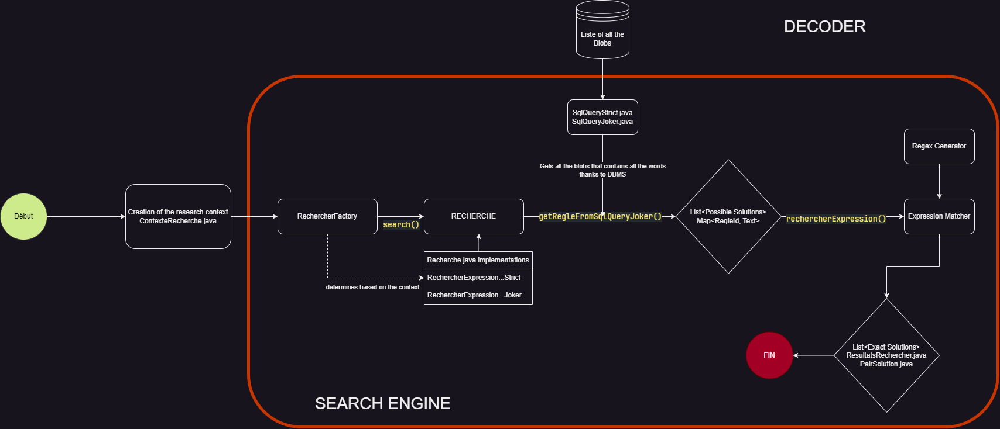
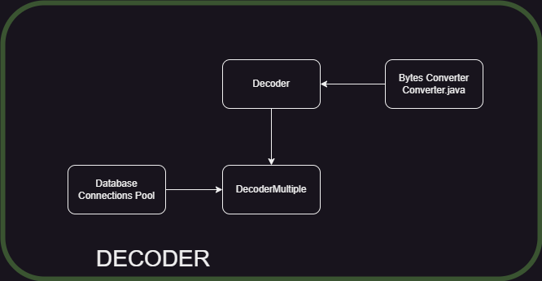
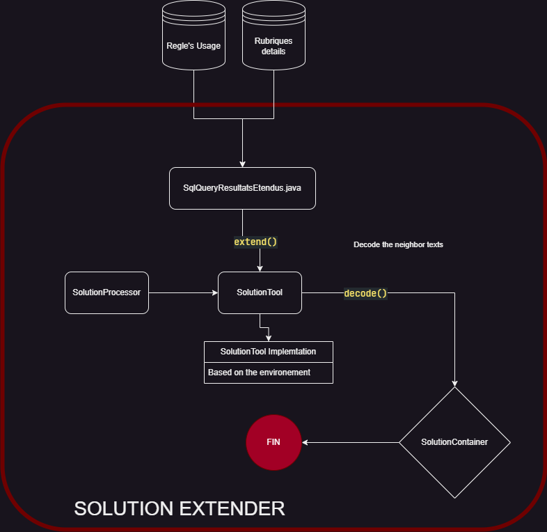

# Technical Documents

## Search Engine

Éric PHILIPPE

2023/2024

---

## Abstract

This document presents all the technical details of the search engine project carried out during my apprenticeship at ADP. The project consisted of setting up a search engine for expressions in BLOBs stored in a database.

## Table of Contents

- [1. Introduction](#1-introduction)
- [2. Process of the Search Engine](#2-process-of-the-search-engine)
  - [2.1 Global view](#21-global-view)
  - [2.2 Detailed view](#22-detailed-view)
    - [2.2.1 Search Engine](#221-search-engine)
    - [2.2.2 Decoder](#222-decoder)
    - [2.2.3 Solution Extender](#223-solution-extender)
- [3. MLD (Model Logical Diagram)](#3-mld-model-logical-diagram)
- [4. Highligths](#4-highligths)
- [5. Weaker Points](#5-weaker-points)

## 1. Introduction

## 2. Process of the Search Engine

### 2.1 Global view

You can find below the global view of the search engine.

> I really advise you to directly open one of the `SearchEngine.drawio` files in the `res/` folder to have a better view of the search engine in the extension of your choice (`.drawio`, `.png`, `.svg`, `.html`).

### 2.2 Detailed view

#### 2.2.1 Search Engine

#### 2.2.2 Decoder

#### 2.2.3 Solution Extender

## 3. MLD (Model Logical Diagram)

## 4. Highligths

## 5. Weaker Points
