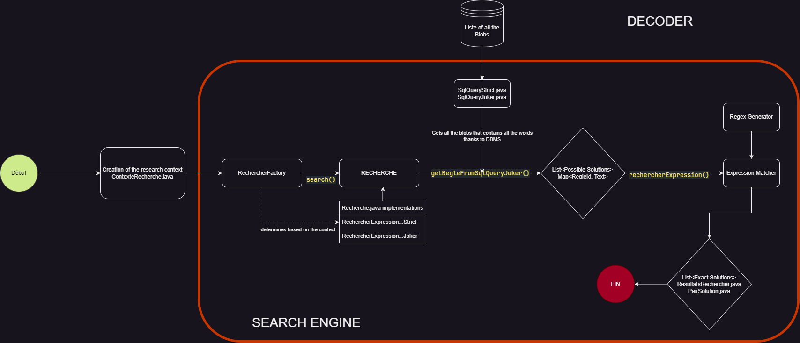
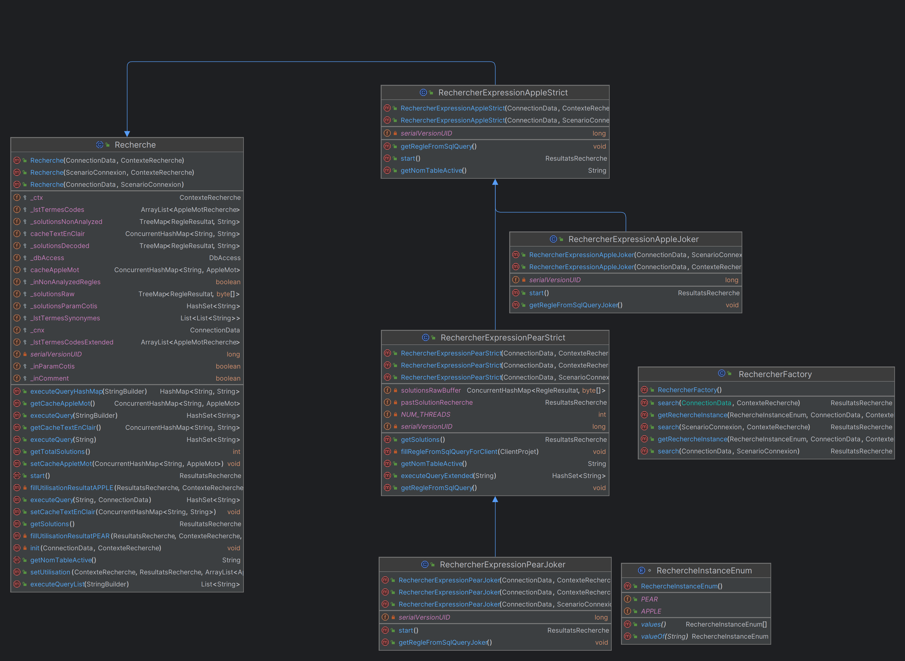
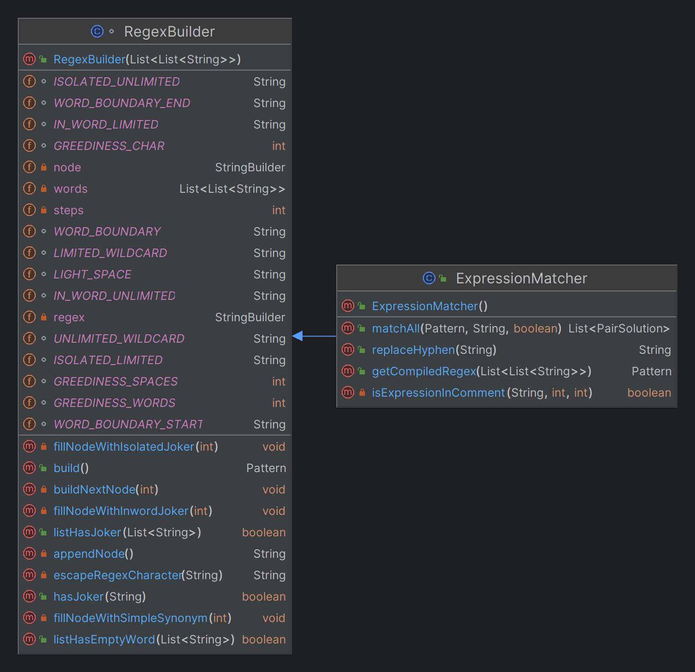
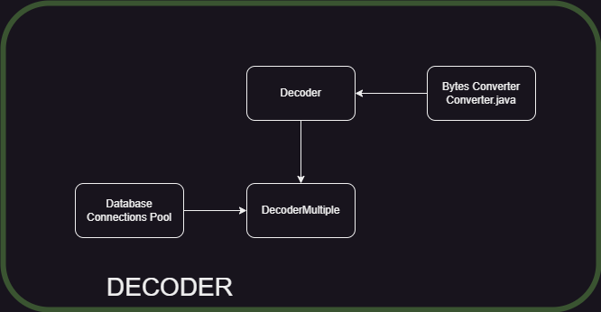
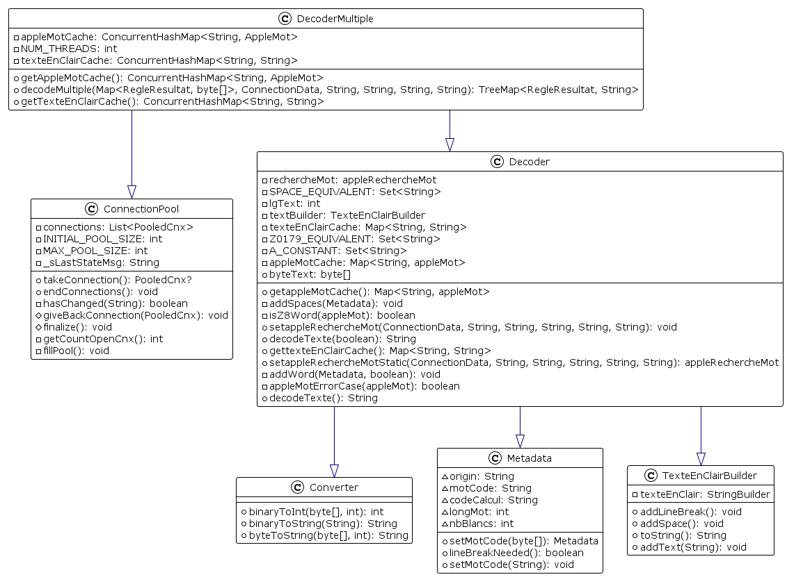
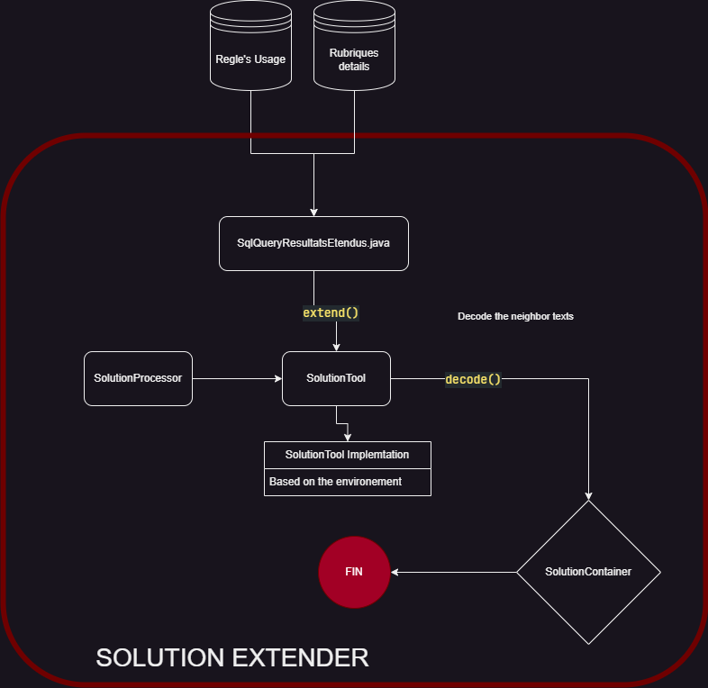
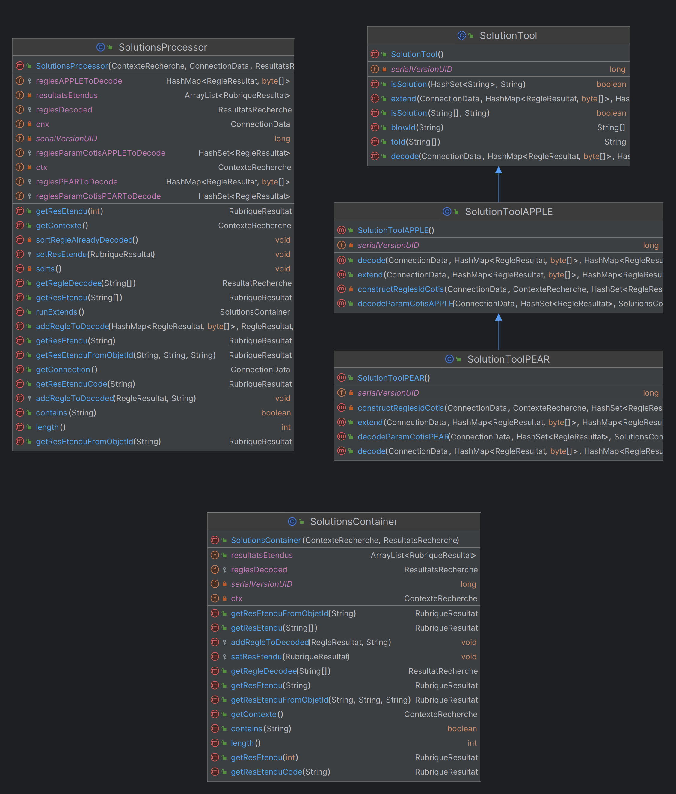

# Technical Documents

## Search Engine

Éric PHILIPPE

2023/2024

---

## Abstract

This document presents all the technical details of the search engine project carried out during my apprenticeship at ADP. The project consisted of setting up a search engine for expressions in BLOBs stored in a database.

## Table of Contents

- [1. Introduction](#1-introduction)
- [2. Process of the Search Engine](#2-process-of-the-search-engine)
  - [2.1 Global view](#21-global-view)
  - [2.2 Detailed view](#22-detailed-view)
    - [2.2.1 Search Engine](#221-search-engine)
    - [2.2.2 Decoder](#222-decoder)
    - [2.2.3 Solution Extender](#223-solution-extender)
- [3. Highligths](#3-highligths)
- [4. Weaker Points And possible improvements](#4-weaker-points-and-possible-improvements)

## 1. Introduction

## 2. Process of the Search Engine

### 2.1 Global view

You can find below the global view of the search engine.

> I really advise you to directly open one of the `SearchEngine.drawio` files in the `res/` folder to have a better view of the search engine in the extension of your choice (`.drawio`, `.png`, `.svg`, `.html`).


### 2.2 Detailed view

Between each step of the search engine, we can find three main components:

#### 2.2.1 Search Engine

The first and main component of the search engine is the search engine itself. It is responsible for searching for the expressions in the BLOBs stored in the database.



---

#### Contexte Recherche

The caller first create a `ContexteRecherche` object, that can be tweaked to match the caller's needs. Almost everything is configurable and documented about the ContexteRecherche object. `ContexteRecherche.java` is at the end just a holder of plenty setter and getter methods and a few other methods to setup itself fetching de database.

---

#### RechercherFactory / Recherche

The `RechercherFactory` is a factory that creates `Recherche` objects. The `Recherche` object is the object that will actually search for the expressions in the BLOBs. The `Recherche` parent object is implemented by four classes, each one corresponding to the two different environments (Apple, Pear) and the two different types of search (strict, with jokers).

The main steps just after the factory are :

1. Using the `SqlQueryStrict/Joker.java` class to build the SQL query, in order to use the `DBMS_LOB.INSTR` function to search for the words in the BLOBs.
   We can't use the `LIKE` operator because it is not efficient enough for our needs, the Blob are way too big and any classic String method is compromised by the threshold of the Blob size.

> Here we have all the blobs that contains every word of the expression, **regardless of the order of the words.** ; It's the big losange in the diagram.

2. We then sort the possible solutions found by their location, if they are from a comment, directly a coded text, etc.



3. We then use the `ExpressionMatcher` class to match the expressions with the solutions found. It used itself the `RegexBuilder` class to build the regular expressions. The regex allowing to search for expression, using synonyms of the words, and also implementing the jokers.



---

#### Expression Matcher - Regex

The algorithm is quite simple

```txt
-- We receive in entry a List<List<String>> representing the expression ordered, each List<String> being a list of synonyms for a word.

-- Case 1 : No Jokers, only synonyms
-- Case 2 : Isolated Jokers
-- Case 3 : Jokers in the middle of the expression

Add the entry regex `(?:^|\\s\\(|\\s{1,100})`

For each List<String> in the List<List<String>> :
    -- Determine if the List<String> contains a joker
    -- If it does, we build a regex with the joker
    -- If it doesn't, we build a regex with the synonyms

Add the exit regex `(?:$|\\s\\)|\\s{1,100})`
```

> Checkout the `RegexGenerator` class for more details.

---

#### ResultatRecherche

At this point, we have all the solutions found, and we can now extend them. The `ResultatRecherche` class is responsible for containing the solutions found respectively and everything is stored in a `List<ResultatRecherche>` inside the `ResultatsRecherche` class.

We can completly stop the process at this point, or we can extend the solutions found.

---

#### Search Engine - Conclusion

The main search engine really puts more emphasis on the Regex and the Factory Pattern. The search engine is really generic and can be used in any context, and the search engine is really efficient and can be used in any context.

#### 2.2.2 Decoder

During the search process, we need a few times to decode the BLOBs. The previous decoder was not efficient enough, so I had to rewrite it. I also implemented a multithreading system to decode multiple BLOBs simultaneously that really made the process faster. The multi-threading system needed a database connection pool to manage the threads, given that using one database connection for every thread would have been a disaster. I also implemented a cache system to avoid re-processing words that have already been processed. I also rewrote the Byte[] converters to be more efficient using bytes shifting (see `src/decoder/Converter.java`).





#### Decoder - Conclusion

The Decoder allowed me to really make a great usage of the multithreading system, and the cache system. The byte[] converter made a great opportunity for me to learn more about bytes shifting and how to use it to make the process faster.
It also was a great opportunity to implement the Database Connection Pool, and to learn more about it.

#### 2.2.3 Solution Extender

Once the results are available, the application utilizing them must leverage them within the environment and context in which these solutions are used. This is significantly more tailored to the application and required a vast number of SQL queries to obtain extended results. Therefore, I engineered a massive yet optimized SQL query to obtain extended results in a single query and utilize them in the application, as detailed in the technical documentation.

After we extended the solutions, we have to decode the neighboring BLOBs to give the full context. We use again the `DecoderMultiple` at its full potential to decode multiple BLOBs simultaneously. We then sort the solutions by their location, and we can then return the extended solutions in a proper `SolutionContainer` object that is way lighter in order to be sent from the server to the client.





## 3. Highligths

- The search engine is really efficient and can be used in any context. **ContexteRecherche**.

- The search engine is really generic and can be used in any context thanks to the **Factory Pattern**.

```java
  /**
  * Méthode SERVER ORIENTEE unifiée de recherche se basant sur le
  * ContexteRecherche pour diriger cette derniére
  *
  * @param ctx - ContexteRecherche
  * @return Solutions trouv�e pour la recherche
  * @throws InterruptedException - Thread cassé
  * @throws Exception
  */
  public static <ConnectionData> ResultatsRecherche search(ConnectionData cnx, ContexteRecherche ctx) throws InterruptedException, Exception, AppleException {
    boolean ppc = ctx.getSearchInPear();
    boolean apple = ctx.getSearchInApple();

    Recherche recherche = null;
    ResultatsRecherche solution = null;

    if (!ppc && apple) {
      recherche = getRechercheInstance(RechercheInstanceEnum.APPLE, cnx, ctx);
      solution = recherche.start();
    } else if (ppc && !apple) {
      recherche = getRechercheInstance(RechercheInstanceEnum.PEAR, cnx, ctx);
      solution = recherche.start();
    } else if (ppc && apple) {
      recherche = getRechercheInstance(RechercheInstanceEnum.APPLE, cnx, ctx);
      solution = recherche.start();
      ConcurrentHashMap<String, AppleMot> cacheAppleMot = recherche.getCacheAppleMot();
      ConcurrentHashMap<String, String> cacheTextEnClair = recherche.getCacheTextEnClair();
      recherche = getRechercheInstance(RechercheInstanceEnum.PEAR, cnx, ctx, solution, cacheAppleMot, cacheTextEnClair);
      solution = recherche.start();
    }

    return solution;
  }
```

- The implementation of the jokers was a real challenge, that makes a great and deep usage of the **Regex**.

- The **Decoder** allowed me to really make a great usage of the multithreading system, and the cache system. The byte[] converter made a great opportunity for me to learn more about bytes shifting and how to use it to make the process faster.

```java
public TreeMap<RegleResultat, String> decodeMultiple(Map<RegleResultat, byte[]> texteCode, ConnectionData cnx, String model,
                            String version, String project, String produit) throws AppleException {
  ConcurrentHashMap<RegleResultat, String> solutionsDecoded = new ConcurrentHashMap<>();

  ExecutorService executorService = Executors.newFixedThreadPool(NUM_THREADS);

  for (Map.Entry<RegleResultat, byte[]> values : texteCode.entrySet()) {
    executorService.execute(new Runnable() {

      @Override
      public void run() {
        // Récupération d'une connection dans la pool disponible
        try (PooledCnx pcnx=ConnectionPool.takeConnection()){
          RegleResultat regleResultat = values.getKey();
          byte[] appleTexteCode = values.getValue();

          // Récupération de la classe de recherche de mot
          AppleRechercheMot rechercheMot = Decoder.setAppleRechercheMotStatic(pcnx.getCnxData(), model, version, project,
              produit, regleResultat.getClientId());

          // Récupérations des valeurs et lancement du décodeur
          Decoder decoder = new Decoder(appleTexteCode, rechercheMot, appleMotCache, texteEnClairCache);
          String texte = decoder.decodeTexte(true);
          appleMotCache.putAll(decoder.getAppleMotCache());
          texteEnClairCache.putAll(decoder.gettexteEnClairCache());
          solutionsDecoded.put(regleResultat, texte);
        } catch (Exception e) {
          Logger.error(e.toString(), e);
        } // autoclose du PooledCnx par le pattern try-resource
      }
    });
  }

  executorService.shutdown();
  try {
    // Attend que tous les threads aient termin� avant de renvoyer la TreeMap
    executorService.awaitTermination(Long.MAX_VALUE, TimeUnit.NANOSECONDS);
  } catch (InterruptedException e) {
    Thread.currentThread().interrupt();
  }

  ConnectionPool.endConnections();

  TreeMap<RegleResultat, String> solMap = new TreeMap<>();
  solMap.putAll(solutionsDecoded);
  return solMap;
}
```

## 4. Weaker Points And possible improvements

- The whole layout / structure of the project can be heavily improved, the project became really big and the structure is not really adapted to the size of the project.

- Due to a lot of changes in the project while I was working on it, the project suffered from a lot of unused code, that could be removed.

- A part of the documentation is in French for my colleagues and a part is in English, because, WHY NOT.
